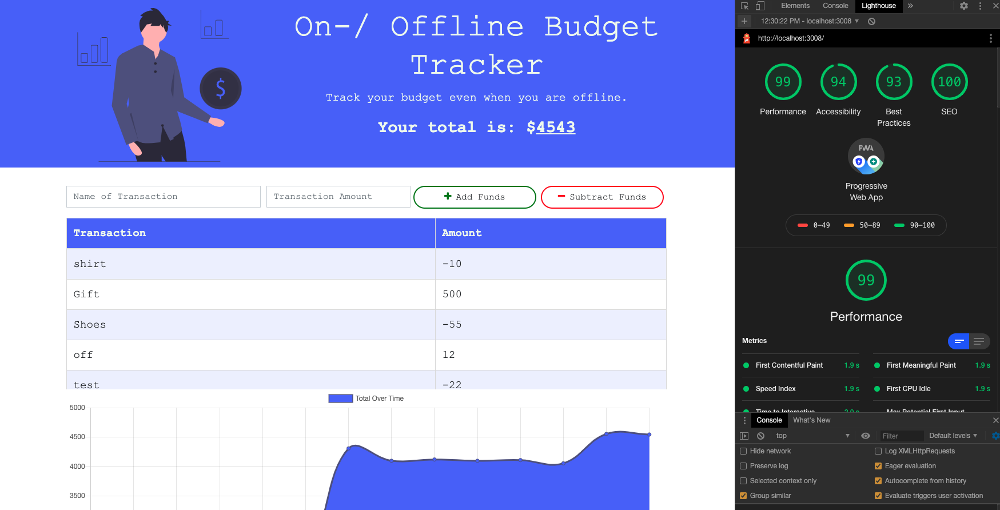

# PWA On-/ Offline Budget Tracker

## Table of Content

- [User Story](#User)

- [Business Context](#Business-Context)

- [Description](#Description)

- [Technologies Used](#Technologies-Used)

- [Installation](#Installation)

- [Deployed Link](#Deployed)

## User Story

```
AS AN avid traveller
I WANT to be able to track my withdrawals and deposits with or without a data/internet connection
SO THAT my account balance is accurate when I am traveling
```

## Business Context

Giving users a fast and easy way to track their money is important, but allowing them to access that information anytime is even more important. Having offline functionality is paramount to our applications success.

## Description

This application is a budget tracker that can track your expenses even offline as a progressive web application. For the full offline experience, open the application in a new Chrome tab. Open Chrome's three-dot menu (next to the address bar) and click on "Install Online-Offline Budget Tracker" in the menu.

## Technologies Used

The used technologies include a Mongo database with a Mongoose Schema. Routes are handled with Express.js. The charts are made with chart.js, the CSS framework is Twitter Bootstrap and IndexedDB as a low-level API for client-side storage.

## Installation

Git pull and run the following command:

```
    npm install
```

## Deployed Link:

The heroku deployed link: <a href="https://steffield-pwa-budget-tracker.herokuapp.com/">PWA Budget Tracker</a>.



## Questions

If you have any questions about the repo, open an issue.


